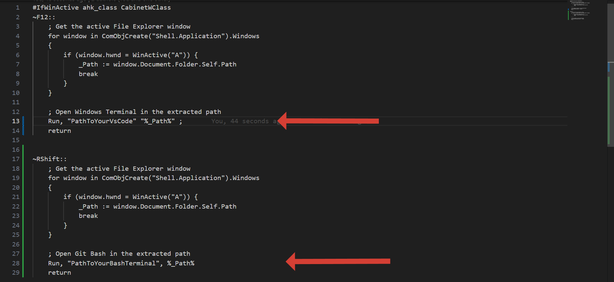

# 🚀 Open VS Code & Git Bash from File Explorer with AutoHotkey

This **AutoHotkey (AHK) script** allows you to quickly open either **Visual Studio Code** or **Git Bash** in the **current File Explorer directory** using simple hotkeys.

---

## 🔹 Features
- ✅ **F12** → Open **VS Code** in the active File Explorer folder  
- ✅ **Right Shift** → Open **Git Bash** in the active File Explorer folder  
- ✅ Uses **COM objects** for accurate path extraction  
- ✅ Minimal setup – super useful for developers!

---

## 🛠 Installation & Usage

1. **Install AutoHotkey v1.1.37.02** – [Download here](https://www.autohotkey.com/)  
2. **Download this script** from the repository  
3. **Edit Paths**:  
   Open the `.ahk` file in any editor and update the paths to your local installations:
   - `VS Code` path (usually in `AppData`)
   - `Git Bash` path (usually in `Program Files`)
   
4. **Run the script** (double-click the `.ahk` file)  
5. **Usage**:
   - ▶️ Press **F12** in File Explorer → Opens folder in **VS Code**
   - ▶️ Press **Right Shift** in File Explorer → Opens folder in **Git Bash**

---

## 📌 Requirements

- **Windows** with [AutoHotkey v1](https://www.autohotkey.com/) installed  
- **Visual Studio Code** installed  
  - Add `code` to PATH:
    - `Ctrl + Shift + P` → Search `"Shell Command"` → Select **“Install 'code' command in PATH”**
- **Git for Windows** (includes Git Bash)

---

## 🎯 Notes
- Run AutoHotkey with **Administrator privileges** if needed.  
- Customize the script to use a different key if `F12` is already in use or add keys to your preference

---

### 🔗 Contributing
Feel free to open **issues** or submit **pull requests** to improve the script! 😊  

---

### ⚡ License
This project is **open-source** and released under the **MIT License**.
